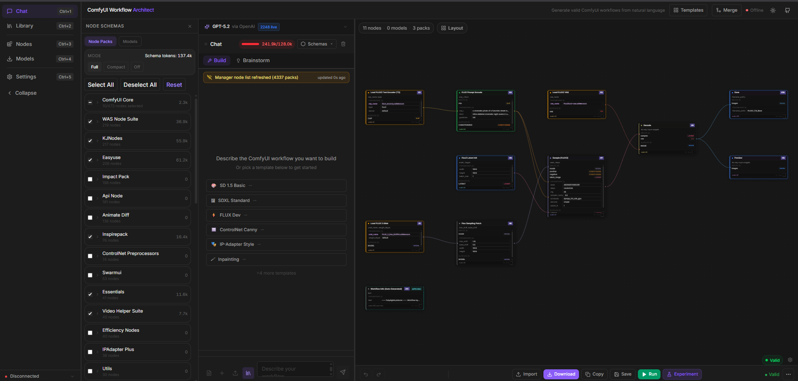
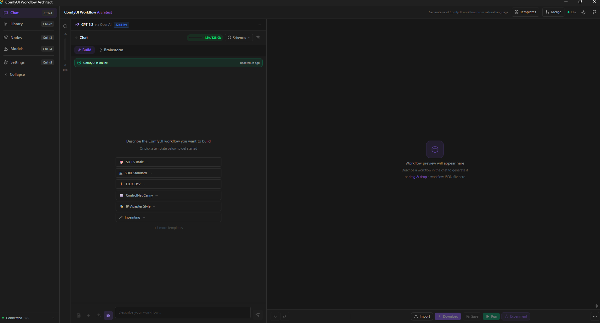

# AI Architect

**Natural language → valid ComfyUI workflow JSON**


---

## Screenshots

<table>
  <tr>
    <td></td>
    <td></td>
  </tr>
</table>

---

## What it does

Describe an image generation pipeline in plain English; AI Architect produces a valid ComfyUI workflow JSON you can load or execute immediately. It supports multiple AI providers (Claude, GPT-4o, Gemini, OpenRouter) and builds context-aware prompts from the live node registry of your running ComfyUI instance. Generated workflows go through multi-stage validation and are automatically corrected when the model produces invalid node connections or missing inputs.

---

## Features

- **Multi-provider AI** — 12+ models across Anthropic, OpenAI, Google, and OpenRouter; per-model token budgeting
- **Visual node graph** — ReactFlow canvas with auto-layout, type-checked edge connections, and inline editing
- **Live ComfyUI integration** — `/object_info` sync for node discovery, WebSocket execution pipeline, error auto-correction loop
- **Context-aware prompting** — system prompt assembled from live node registry + installed checkpoints/LoRAs at generation time
- **MCP server** — exposes ComfyUI operations as tools consumable by Cursor or any MCP-compatible IDE
- **Zero-backend architecture** — fully client-side; AI calls go browser-direct, state persisted in localStorage

---

## Stack


-009688?style=flat-square&logo=fastapi&logoColor=white)


---

## Status

| Component | Status |
|---|---|
| Frontend (browser) | Complete — functional in browser dev mode |
| Tauri desktop shell | Scaffolded — window opens; direct fetch to AI APIs blocked by OS sandbox (WIP) |
| FastAPI backend | ~20% stubbed — scaffolding only, no production routes |
| Test suite | Not present |

---

## Setup

**Prerequisites:** Node 20+, pnpm, Rust toolchain (for Tauri), a running ComfyUI instance

```bash
cd webapp
pnpm install
cp .env.example .env          # fill in your AI provider keys
pnpm dev                      # browser — http://localhost:5173
pnpm tauri:dev                # desktop build (requires Rust)
```

Set `VITE_COMFYUI_URL` in `.env` to point at your ComfyUI instance (default `http://127.0.0.1:8188`).

For local path overrides (ComfyUI root, Python exe, etc.):

```bash
cp .env.secret.example .env.secret   # fill in absolute paths, never committed
```

---

## MCP Server

```bash
cd mcp-server
pnpm install
pnpm start
```

Add the server to your Cursor MCP config to expose ComfyUI tools (`queue_prompt`, `get_history`, `get_models`, etc.) inside the IDE.

---

## Project Layout

```
webapp/          React + Vite frontend + Tauri shell
mcp-server/      TypeScript MCP server
scripts/         Bootstrap and check scripts (PowerShell)
docs/            Screenshots and internal docs
```
